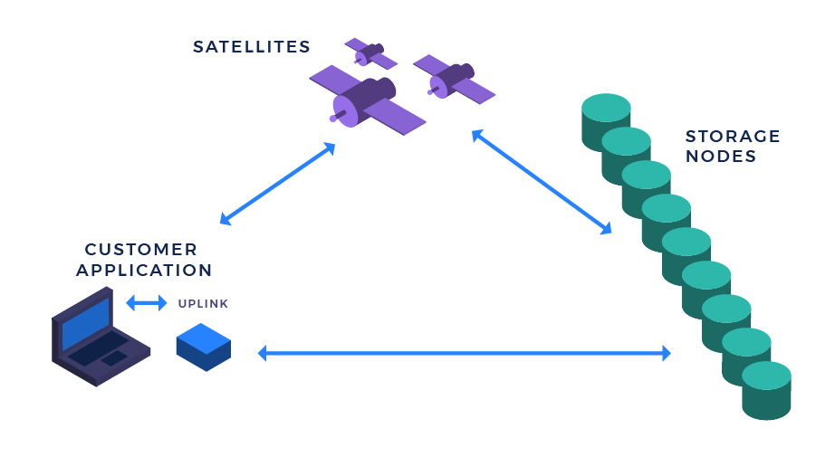

# Storj测试网

工具 `storj-sim` 可以帮助你运行Storj网络的所有组件(Satellite, Storage Nodes, Console 和 Gateway), 并且在自己的计算机上测试Storj网络。



真实生产场景中Satellite, Storage Node 和 Uplink是部署并运行在不同机器上的。但是出于测试目的, 下述操作将所有组件同时运行在本地机器。

# 安装及配置

首先需要安装Golang(版本不低于1.11) [Go 1.11](https://www.golang.org/). 
Golang安装好之后, 下载Storj代码并编译:

```bash
git clone https://github.com/storj/storj.git storj
cd storj
make install-sim
```

_确保 `storj` 文件夹在`GOPATH` 之外, 否则可能会报错._

上述命令会安装 storj-sim, satellite, storage node, gateway 和 uplink 的可执行文件到你配置的GOPATH目录下. 默认路径为: `~/go/bin`.


接下来配置节点信息, 运行:

```bash
storj-sim network setup
```

到此你已经配置好了Storj的测试网络。

你可以到配置目录下查看名为config.yaml的配置文件内容, 看看有哪些配置可以选择。

你也可以通过添加参数: `-x` 或 `--print-commands` 来查看进程的启动过程。

接下来让我们运行它!

# 启动测试网络

到此网络已经配置好了,我们通过以下命令启动测试网:

```bash
storj-sim network run
```

你的测试网已经在运行了. 你可以看到命令行的输出包含Amazon S3网关的秘钥, 可以后续适配Amazon S3的客户端。

默认配置的端口分配规则如下:

* Gateways 的起始端口 `9000`
* Bootstrap server 的起始端口 `9999`
* Satellites 的起始端口 `10000`
* Storage Nodes 的起始端口 `11000`

### 运行测试

`storj-sim network test <command>` 可以用来运行测试.

`storj-sim` 用来启动Storj的网络并执行指定的命令: `<command>`.

网络中所有展示信息都是带着标识, 所有的标识都以一个前缀_编号开始.

* 地址: `STORAGENODE_0_ADDR`, `SATELLITE_0_ADDR`, `GATEWAY_0_ADDR`
* 秘钥: `GATEWAY_0_ACCESS_KEY`, `GATEWAY_0_SECRET_KEY`
* 文件夹: `STORAGENODE_0_DIR`, `SATELLITE_0_DIR`, `GATEWAY_0_DIR`

这里展示一个真实的例子 [test-sim.sh](https://github.com/storj/storj/blob/master/scripts/test-sim.sh) 和 [test-sim-aws.sh](https://github.com/storj/storj/blob/master/scripts/test-sim-aws.sh).

### 清理网络

`storj-sim network destroy` 可以容易地清理网络.

开发过程中需要经常删除文件和配置, 所以你可以简单的执行下面命令实现:

`storj-sim network destroy && storj-sim network setup && storj-sim network test bash my-test-script.sh`

***

## 下一章节
请查看 [Uplink CLI](Uplink-CLI.md) 或 [S3 Gateway](S3-Gateway.md)
学习如何在Storj的测试网络中上传/下载数据。

让我们通过去中心化把所有事物链接在一起!
